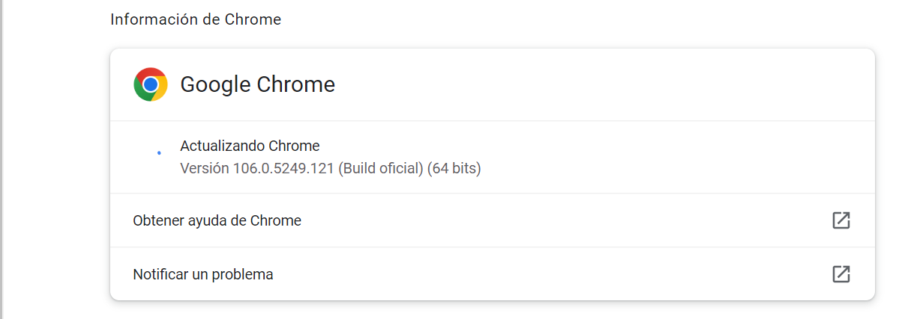
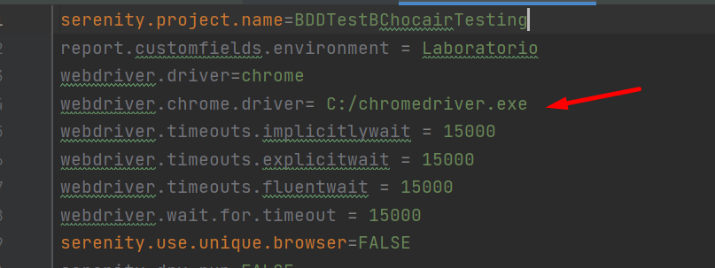

# StartSharp
Se realiza un proyecto automatizado de dicha aplicación que consta en poder crear una unidad de negocio y poder agendar una reunión.
Se realiza el flujo de crear unidad de negocio con 2 variables parametrizadas desde el feature.
El flujo de de agendar reunión se realiza un mapa de datos desde el feature para agendar la reunión.
El aserción se realiza mediante el nombre de la reunión. 

# Herramientas 
Para el desarrollo de estas pruebas se usaron las siguientes herramientas:
- Java version 1.8
- Eclipse IDE or IntelliJ IDEA (version 2019 )
- Gradle version 7.1
- Cucumber for Java Plugin (updated version).
- Gherkin Plugin (updated version).
- ChromeDriver Versión

## Instalación
URL:https://github.com/Mateboup/BDDTestChocairTesting.git
`$ git clone url`

Para correr la prueba debemos: 
Validar la versón del chrome vigente en la siguiente ruta : Ayuda - Información del Google Chrome 
 
Al valida la versión del chrome debes ir link https://chromedriver.chromium.org/downloads y descargar la misma versión del Chrome Driver que se tiene en Google Chrome
Luego de esto se debe descomprimir el archivo y dejarlo en el Disco Local C, Para que la prueba se correa exitosamente.
De otra manera debes ir a las configuraciones en Serenity.properties y realizar el cambio de ubicación del chrome driver: 

